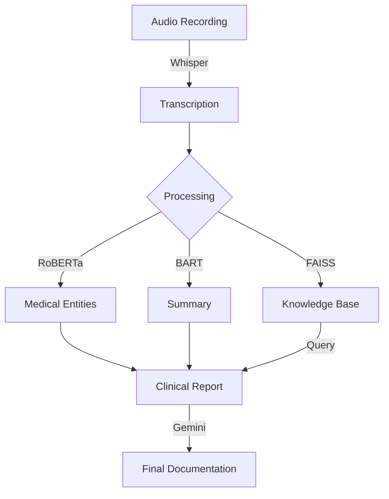

# Medical-Transcription-Analysis-using-LLMs
  
# 🩺 Medical-Transcription Agents

[](https://opensource.org/licenses/MIT)
[](https://www.python.org/downloads/)
[](https://huggingface.co/)
[](https://openai.com/)
[](https://ai.google.dev/)

**Turn medical conversations into comprehensive clinical documentation with AI**

---

## 🌟 What is Medical-Transcription Agents?

Medical-Transcription Agents transforms the way healthcare professionals document patient interactions. This powerful system converts medical audio recordings into structured clinical reports, extracting key information and generating professional documentation in seconds.


## ✨ Key Features

<table>
  <tr>
    <td width="50%">
      <h3>🎙️ Speech-to-Text Excellence</h3>
      <p>Convert medical conversations to text with industry-leading accuracy using OpenAI's Whisper model</p>
    </td>
    <td width="50%">
      <h3>🔍 Medical Entity Recognition</h3>
      <p>Automatically identify symptoms, conditions, medications, and medical terminology</p>
    </td>
  </tr>
  <tr>
    <td width="50%">
      <h3>📝 Smart Summarization</h3>
      <p>Distill lengthy consultations into concise, relevant clinical summaries</p>
    </td>
    <td width="50%">
      <h3>🧠 Knowledge Base Integration</h3>
      <p>Store, search and retrieve patient information using semantic similarity</p>
    </td>
  </tr>
  <tr>
    <td width="50%">
      <h3>📊 Clinical Report Generation</h3>
      <p>Produce comprehensive, structured reports following medical best practices</p>
    </td>
    <td width="50%">
      <h3>💬 Medical Jargon Translation</h3>
      <p>Automatically provide patient-friendly explanations of complex terminology</p>
    </td>
  </tr>
</table>

## 🚀 Quick Start

### Installation

```bash
# Clone the repository
git clone https://github.com/yourusername/Medical-Transcription-Analysis-using-LLMs.git
cd Medical-Transcription-Analysis-using-LLMs

# Set up virtual environment
python -m venv venv
source venv/bin/activate  # On Windows: venv\Scripts\activate

# Install dependencies
pip install -r requirements.txt

# Or run makefile command

make install
```

### Configuration

Create a `.env` file in the project root:

```
GOOGLE_API_KEY=your_google_api_key   

# https://aistudio.google.com/app/apikey
```

## 📂 Project Structure

```
.
├── src/
│   ├── main.py                           # Main entry point
│   └── medical_transcription/
│       ├── __init__.py
│       ├── api/                          # FastAPI application
│       │   ├── __init__.py
│       │   └── app.py
│       ├── knowledge_base/               # Vector store for medical knowledge
│       │   ├── __init__.py
│       │   └── vector_store.py
│       ├── ner/                          # Named Entity Recognition for medical terms
│       │   ├── __init__.py
│       │   └── medical_ner.py
│       ├── report_generation/            # Clinical report generation
│       │   ├── __init__.py
│       │   └── report_generator.py
│       ├── summarization/                # Text summarization
│       │   ├── __init__.py
│       │   └── text_summarizer.py
│       └── transcription/                # Audio transcription with Whisper
│           ├── __init__.py
│           └── whisper_transcriber.py
├── examples/                             # Example scripts
│   └── process_audio.py
├── tests/                                # Test scripts
│   └── test_installation.py
├── requirements.txt                      # Project dependencies
├── setup.py                              # Package installation script
├── .env.example                          # Example environment variables
├── Makefile                              # Common development tasks
├── LICENSE                               # MIT License
└── README.md                             # This file
```

## 🔧 The Tech Stack

<div align="center">
  
| Component | Technology | Description |
|:----------|:-----------|:------------|
| **Transcription** | 🔊 `Whisper` | OpenAI's state-of-the-art audio processing model |
| **NER** | 🏷️ `RoBERTa-NER` | Advanced named entity recognition for medical terms |
| **Summarization** | 📋 `BART-CNN` | BART model fine-tuned for condensing information |
| **Vector Search** | 🔎 `FAISS` | Fast vector similarity search for knowledge retrieval |
| **LLM Support** | 🧠 `Mistral-7B` | Instruction-tuned language model for Q&A |
| **Report Generation** | ✍️ `Gemini-1.5` | Google's Gemini model for clinical narratives |

</div>

## 📊 Pipeline Architecture



## 💻 Example Output

<details>
<summary>Click to expand example clinical report</summary>

```markdown
### **Patient Clinical Report**  
**Patient Information:**  
- Name: Asha Kumari
- Age: 45  
- Gender: Male  
- Date of Visit: February 10, 2025  
- Physician: Dr. Saurabh
  
### **Chief Complaint & History:**  
- **Primary Symptoms:** Persistent cough (2 weeks), fatigue, mild fever (100.2°F)  
- **Medical History:** Hypertension (10 years), Type 2 Diabetes (5 years)  
- **Medications:** Lisinopril 10mg, Metformin 500mg  
- **Allergies:** Penicillin  
  
### **Assessment & Diagnosis:**  
- **Provisional Diagnosis:** Acute bronchitis  
- **Differential Diagnosis:** COVID-19, Seasonal influenza, Pneumonia  

[continues...]
```
</details>

## 🔍 Use Cases

- **Clinical Documentation** - Automatically generate standardized patient visit notes
- **Medical Education** - Create case studies from simulated patient encounters
- **Research** - Convert interviews and focus groups into structured data
- **Telehealth** - Document remote consultations with comprehensive reports

## 📚 API Documentation

The API is available at `http://localhost:8000`. You can access the interactive API documentation at `http://localhost:8000/docs`.

### API Endpoints

- **GET /** - Welcome message and API status
- **POST /transcribe** - Transcribe an audio file
- **POST /extract_entities** - Extract medical entities from text
- **POST /summarize** - Summarize medical text
- **POST /generate_report** - Generate a clinical report
- **GET /download_report/{report_id}** - Download a generated report as PDF
- **POST /process** - Process audio through the entire pipeline
- **POST /query_knowledge_base** - Query the medical knowledge base
- **POST /explain_medical_terms** - Get simple explanations for medical terms

### Example: Processing an Audio File

```python
import requests

# Transcribe an audio file
with open('patient_recording.wav', 'rb') as f:
    files = {'audio_file': f}
    response = requests.post('http://localhost:8000/transcribe', files=files)
    
transcription = response.json()['transcription']
print(f"Transcription: {transcription}")

# Extract medical entities
entities_response = requests.post(
    'http://localhost:8000/extract_entities',
    json={'text': transcription}
)
entities = entities_response.json()['entities']
print(f"Medical entities: {entities}")

# Generate a summary
summary_response = requests.post(
    'http://localhost:8000/summarize',
    json={'text': transcription}
)
summary = summary_response.json()['summary']
print(f"Summary: {summary}")

# Generate a report
report_response = requests.post(
    'http://localhost:8000/generate_report',
    json={
        'entities': entities,
        'summary': summary
    }
)
report_id = report_response.json()['report_id']
print(f"Report generated with ID: {report_id}")

# Download the report
report_pdf = requests.get(f'http://localhost:8000/download_report/{report_id}')
with open('clinical_report.pdf', 'wb') as f:
    f.write(report_pdf.content)
print("Report downloaded as clinical_report.pdf")
```

## 🌱 Roadmap

- [ ] Multi-language support for global healthcare settings
- [ ] Specialty-specific templates (cardiology, neurology, etc.)
- [ ] EHR integration capabilities
- [ ] Mobile application for on-the-go dictation
- [ ] Real-time transcription and analysis

## 🤝 Contributing

Contributions are welcome! Please feel free to submit a Pull Request.

1. Fork the repository
2. Create your feature branch (`git checkout -b feature/AmazingFeature`)
3. Commit your changes (`git commit -m 'Add some AmazingFeature'`)
4. Push to the branch (`git push origin feature/AmazingFeature`)
5. Open a Pull Request

## 📜 License

This project is licensed under the MIT License - see the [LICENSE](LICENSE) file for details.

## 🙏 Acknowledgements

- OpenAI for the Whisper model
- HuggingFace for hosting pretrained models
- Google for the Gemini AI capabilities
- The healthcare professionals who provided testing and feedback

---

<div align="center">
  
Made with ❤️ for the healthcare community

[⭐ Star this repo](https://github.com/yourusername/Medical-Transcription-Analysis-using-LLMs) | [🐛 Report Bug](https://github.com/yourusername/Medical-Transcription-Analysis-using-LLMs/issues) | [📝 Request Feature](https://github.com/yourusername/Medical-Transcription-Analysis-using-LLMs/issues)

</div>

## Frontend UI

The project includes a React-based frontend UI that provides a user-friendly interface for interacting with the Medical Transcription Analysis API.

### Features

- **Home Page**: Overview of the application's features
- **Transcribe Page**: Upload or record audio for transcription
- **Process Page**: Process audio or text through the entire pipeline
- **Knowledge Base Page**: Query the medical knowledge base
- **Explain Terms Page**: Get simple explanations for medical terms

### Running the Frontend

1. Navigate to the frontend directory:
   ```bash
   cd frontend
   ```

2. Install dependencies:
   ```bash
   npm install
   ```

3. Start the development server:
   ```bash
   npm start
   ```

4. Open your browser and navigate to `http://localhost:3000`

### Building for Production

To build the frontend for production:

```bash
cd frontend
npm run build
```

This will create a `build` directory with optimized production files.
