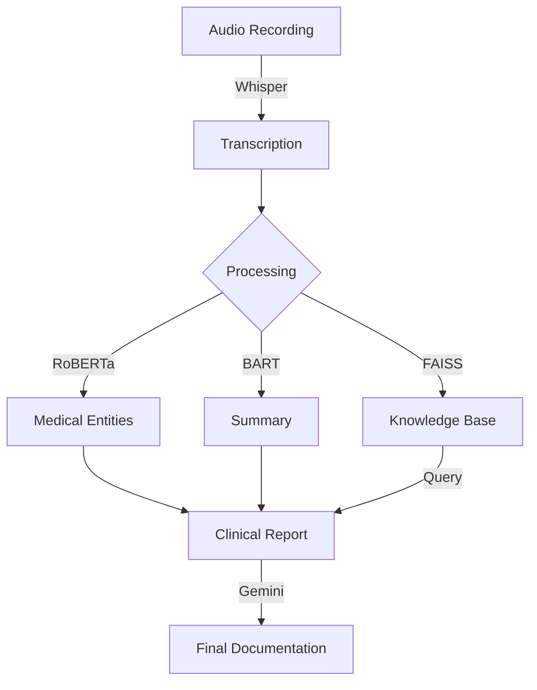

# Medical-Transcription-Analysis-using-LLMs
<div align="center">
  
# 🩺 Medical-Transcription Agents

[](https://opensource.org/licenses/MIT)
[](https://www.python.org/downloads/)
[](https://huggingface.co/)
[](https://openai.com/)
[](https://ai.google.dev/)

**Turn medical conversations into comprehensive clinical documentation with AI**

</div>

<p align="center">
  
</p>

---

## 🌟 What is Medical-Transcription Agents?

Medical-Transcription Agents transforms the way healthcare professionals document patient interactions. This powerful system converts medical audio recordings into structured clinical reports, extracting key information and generating professional documentation in seconds.


## ✨ Key Features

<table>
  <tr>
    <td width="50%">
      <h3>🎙️ Speech-to-Text Excellence</h3>
      <p>Convert medical conversations to text with industry-leading accuracy using OpenAI's Whisper model</p>
    </td>
    <td width="50%">
      <h3>🔍 Medical Entity Recognition</h3>
      <p>Automatically identify symptoms, conditions, medications, and medical terminology</p>
    </td>
  </tr>
  <tr>
    <td width="50%">
      <h3>📝 Smart Summarization</h3>
      <p>Distill lengthy consultations into concise, relevant clinical summaries</p>
    </td>
    <td width="50%">
      <h3>🧠 Knowledge Base Integration</h3>
      <p>Store, search and retrieve patient information using semantic similarity</p>
    </td>
  </tr>
  <tr>
    <td width="50%">
      <h3>📊 Clinical Report Generation</h3>
      <p>Produce comprehensive, structured reports following medical best practices</p>
    </td>
    <td width="50%">
      <h3>💬 Medical Jargon Translation</h3>
      <p>Automatically provide patient-friendly explanations of complex terminology</p>
    </td>
  </tr>
</table>

## 🚀 Quick Start

### Installation

```bash
# Clone the repository
git clone https://github.com/Ayushi-shukla-tech/Medical-Transcription-Analysis-using-LLMs.git
cd Medical-Transcription-Analysis-using-LLMs

# Set up virtual environment
python -m venv venv
source venv/bin/activate  # On Windows: venv\Scripts\activate

# Install dependencies
pip install -r requirements.txt
```

### Configuration

Create a `.env` file in the project root:

```
HUGGINGFACE_API_TOKEN=your_huggingface_token
GOOGLE_API_KEY=your_google_api_key
```

## 🔧 The Tech Stack

<div align="center">
  
| Component | Technology | Description |
|:----------|:-----------|:------------|
| **Transcription** | 🔊 `Whisper` | OpenAI's state-of-the-art audio processing model |
| **NER** | 🏷️ `RoBERTa-NER` | Advanced named entity recognition for medical terms |
| **Summarization** | 📋 `BART-CNN` | BART model fine-tuned for condensing information |
| **Vector Search** | 🔎 `FAISS` | Fast vector similarity search for knowledge retrieval |
| **LLM Support** | 🧠 `Mistral-7B` | Instruction-tuned language model for Q&A |
| **Report Generation** | ✍️ `Gemini-1.5` | Google's Gemini model for clinical narratives |

</div>

## 📊 Pipeline Architecture



## 💻 Example Output

<details>
<summary>Click to expand example clinical report</summary>

```markdown
### **Patient Clinical Report**  
**Patient Information:**  
- Name: Asha Kumari
- Age: 45  
- Gender: Male  
- Date of Visit: February 10, 2025  
- Physician: Dr. Saurabh
  
### **Chief Complaint & History:**  
- **Primary Symptoms:** Persistent cough (2 weeks), fatigue, mild fever (100.2°F)  
- **Medical History:** Hypertension (10 years), Type 2 Diabetes (5 years)  
- **Medications:** Lisinopril 10mg, Metformin 500mg  
- **Allergies:** Penicillin  
  
### **Assessment & Diagnosis:**  
- **Provisional Diagnosis:** Acute bronchitis  
- **Differential Diagnosis:** COVID-19, Seasonal influenza, Pneumonia  

[continues...]
```
</details>

## 🔍 Use Cases

- **Clinical Documentation** - Automatically generate standardized patient visit notes
- **Medical Education** - Create case studies from simulated patient encounters
- **Research** - Convert interviews and focus groups into structured data
- **Telehealth** - Document remote consultations with comprehensive reports

## 🌱 Roadmap

- [ ] Multi-language support for global healthcare settings
- [ ] Specialty-specific templates (cardiology, neurology, etc.)
- [ ] EHR integration capabilities
- [ ] Mobile application for on-the-go dictation
- [ ] Real-time transcription and analysis

## 🤝 Contributing

Contributions are welcome! Please feel free to submit a Pull Request.

1. Fork the repository
2. Create your feature branch (`git checkout -b feature/AmazingFeature`)
3. Commit your changes (`git commit -m 'Add some AmazingFeature'`)
4. Push to the branch (`git push origin feature/AmazingFeature`)
5. Open a Pull Request

## 📜 License

This project is licensed under the MIT License - see the [LICENSE](LICENSE) file for details.

## 🙏 Acknowledgements

- OpenAI for the Whisper model
- HuggingFace for hosting pretrained models
- Google for the Gemini AI capabilities
- The healthcare professionals who provided testing and feedback

---

<div align="center">
  
Made with ❤️ for the healthcare community

[⭐ Star this repo](https://github.com/Ayushi-shukla-tech/Medical-Transcription-Analysis-using-LLMs) | [🐛 Report Bug](https://github.com/Ayushi-shukla-tech/Medical-Transcription-Analysis-using-LLMs/issues) | [📝 Request Feature](https://github.comAyushi-shukla-tech/Medical-Transcription-Analysis-using-LLMs/issues)

</div>
